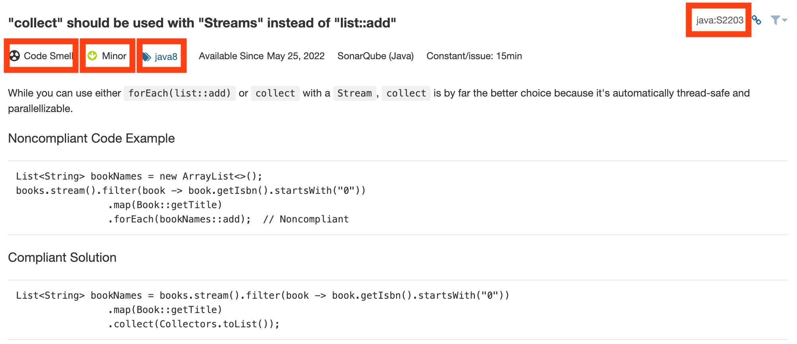

## 개요

- jekyll 기반으로 호스팅되므로 jekyll 의 기본 프로젝트 구조 및 의미는 [다음](https://jekyllrb-ko.github.io/docs/structure/) 을 참고하세요.

## 게시물 작성

- 작성되어 게시될 포스트들은 `_post` 디렉토리 하위의 언어 / 시스템 등 카테고리에 맞는 폴더 하위ㅇ[] `YEAR-MONTH-DAY-title.md` 와 같은 형식으로 저장되어야 합니다.
  ```
  ├── posts
  │   └── java
  │      └── 2022-12-27-sonarkube-java-spring8-try-with-resources.md
  │      └── 2023-01-01-new-year-에도-코딩을-하다니.md
  ```
- 게시글의 처음은 [front-matter](https://jekyllrb-ko.github.io/docs/front-matter/) 형식으로 작성되어야 합니다. 간단하게 아래와 같은 양식으로 작성될 수 있습니다.

  ```
  ---
  layout: post
  title:  "java8 try-with-resources compliant code example."
  ---

  # java8 에 도입된 try-with-resources 는 아래와 같이 사용될 수 있습니다.

  ### Compliant Code
  ...
  ```

- Rules 번역 시, 카테고리화를 위해 아래의 박스친 항목들을 태그화 혹은 카테고리화 하여 관리해야 합니다.  
  카테고리와 태그의 차이는, 카테고리는 permalink 등 url에 포함될 변수로 활용할 수 있지만, 태그는 활용이 불가능 하다는 차이가 있습니다. (그냥 태그쓰셔도 됩니다)  
    
  태그는 front-matter 항목에 tags 혹은 categories 에 배열 형식으로 작성할 수 있습니다.  
  태그에는 기본적으로 **본인이 번역한 문서의 언어**를 포함해주세요!  
  오역 시 바로잡을 수 있도록, 번역한 문서의 하단에 원문 링크를 포함해주세요.

  ```
  2022-12-28-collect-with-streams-instead-of-list::add.md
  ---
  layout: post
  title:  "collect 는 thread-safe 합니다."
  (tags || categories): [java8, Minor, java] # 자바문서기에 java 태그를 꼭 넣어주세요!
  ---
  content....

  ---
  [원문으로 바로가기](https://rules.sonarsource.com/{링크})

  ```

- 아직 포스트 작성이 완료되지 않거나, 발행을 원치 않는 포스트들은 `_drafts` 하위 폴더에 md 파일을 작성해주세요.
  ```
  .
  ├── _drafts
  │   └── 아직-미완성한-파일이에요.md
  ...
  ```
- 중요하다고 생각되는 문서에는 `readthis` 태그를 포함해주세요.
- 주의 : Title 의 시작이 @ 등의 기호인 경우, title 전체를 quote 로 감싸주세요.

  ```javascript
  YYYY-DD-MM-title.md

  title: @Transactional 은 옳지 않습니다. (X)
  title: '@Transactional 은 옳습니다.' (O)
  ```

- 원문 중간의 굵은 글씨는 bold(\*\*)처리가 아닌 h3(###) 을 사용합니다.

  ```markdown
  **규칙을 준수한 코드**
  something... (X)

  ###규칙을 준수한 코드
  something... (O)
  ```
